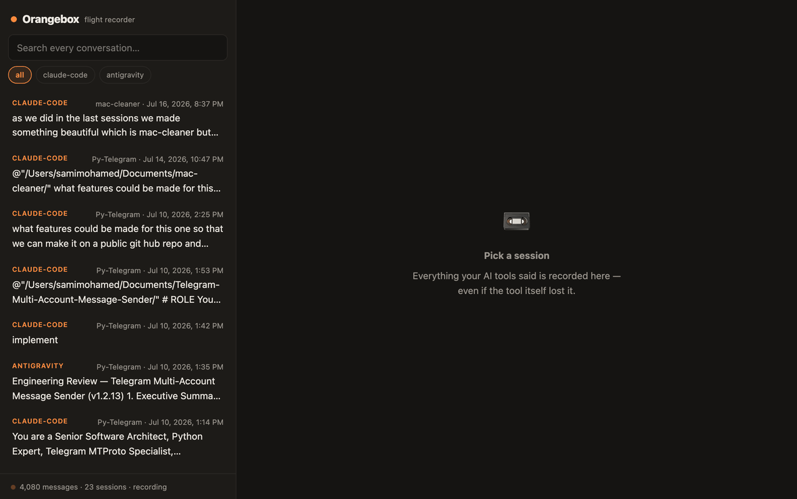

# Orangebox 📼


[](https://crates.io/crates/orangebox)

**A flight recorder for AI coding sessions.** Orangebox watches the local
storage of AI coding tools (Claude Code and Antigravity today; Cursor and
Copilot next) and journals every conversation into a crash-safe, searchable
archive — so a power cut, a force-quit, or a tool losing its own history
never costs you a conversation or an implementation plan again.

**Local-only, forever.** Orangebox makes no network calls, sends no
telemetry, and never writes to any tool's storage — it only reads.



## Supported tools

| Tool | What gets recorded | Status |
| --- | --- | --- |
| Claude Code | Full conversations (JSONL journal) | ✅ |
| Antigravity IDE | Full trajectories: prompts, model reasoning, tool activity, file edits, terminal output | ✅ (trajectories before ~May 2026 use an older format, summaries only) |
| Cursor | — | planned |
| VS Code Copilot Chat | — | planned |

**Platforms:** macOS (fully supported), Windows and Linux (experimental —
builds and tests run in CI on all three; the Windows/Linux tool-storage
paths are best-effort until validated on real installs, see
[#4](https://github.com/samimohameed/orangebox/issues/4)). The always-on
recorder uses launchd on macOS, Task Scheduler on Windows, and systemd
user units on Linux — same `orangebox install` everywhere.

## Getting started

Requires the [Rust toolchain](https://rustup.rs) (1.80+). No Node or other
runtime needed — the web UI ships prebuilt inside the binary.

```sh
cargo install orangebox
```

(Or from source: `git clone https://github.com/samimohameed/orangebox &&
cd orangebox && cargo install --path crates/cli`.)

Then:

```sh
orangebox scan      # backfill everything your tools already have on disk
orangebox install   # always-on: record at login, auto-restart, forever
orangebox ui        # open http://127.0.0.1:7171 — browse, search, recover
```

`scan` is idempotent — run it as often as you like. `install` registers
the platform's autostart service (launchd / Task Scheduler / systemd) so
recording survives reboots and crashes without a terminal window; check on
it with `orangebox doctor`, remove it with `orangebox uninstall`.

### Crash-safety, verified

The archive uses SQLite in WAL mode. `kill -9` mid-ingestion leaves a
consistent database (`PRAGMA integrity_check` passes) and the next scan
picks up exactly what was missed — no duplicates, no corruption. Recorded
conversations are stored as-is (they are already plaintext in each tool's
own storage); secret redaction is on the roadmap.

## Usage

```sh
orangebox scan            # backfill: archive every existing session
orangebox install         # always-on recorder (starts at login)
orangebox uninstall       # stop and remove the always-on recorder
orangebox doctor          # health check: daemon, archive, watch paths
orangebox watch           # record in the foreground instead
orangebox ui              # local web UI — browse, search, recover
                          # (keeps recording while open)
orangebox search "plan"   # full-text search across all tools
orangebox timeline        # recent sessions, newest first
orangebox show <id>       # print one session's transcript
orangebox export <id>     # Markdown recovery document (-o file.md)
orangebox status          # archive stats
orangebox prune --keep-days 90   # optional retention (never automatic)
```

## Recovering a lost session

Sessions can't be injected back into the tools' proprietary histories,
so recovery works forward, not backward:

- **Claude Code** — sessions usually survive locally; run
  `claude --resume <session-uuid>` in the project directory, or use the
  exported Markdown.
- **Antigravity / others** — open the session in `orangebox ui`, press
  **Copy recovery prompt**, paste it into a fresh session, and ask the
  agent to continue from it. Antigravity exports carry the full recorded
  trajectory: your prompts, the model's reasoning, tool activity, file
  contents, and terminal output (recovered from
  `~/.gemini/antigravity-ide/conversations/`).

The archive lives in your platform data directory
(macOS: `~/Library/Application Support/orangebox/archive.db`);
override with `--db <path>`.

## Architecture

Clean Architecture, with the dependency rule enforced by crate boundaries —
inner layers cannot reference outer ones because Cargo won't let them:

```
crates/
  domain/          entities (Session, Message, ToolKind) — zero dependencies
  application/     ports (ToolAdapter, ArchiveRepository interfaces) +
                   services (RecorderService, ArchiveService) with
                   constructor-injected dependencies
  infrastructure/  SQLite repository (WAL + FTS5), tool adapters, watcher
  cli/             clap binary + web server — the composition root, where
                   concrete types are constructed and injected; HTTP DTOs
                   live in src/dto/
ui/                React + TypeScript + Vite app, embedded into the binary
```

Ground rules:

- Adapters are **read-only** over tool storage and **idempotent**
  (re-ingesting a file never duplicates messages).
- Raw parsing failures are never fatal: a torn line from a crash is
  skipped, the rest of the file ingests.
- Format knowledge lives in [FORMATS.md](FORMATS.md).

## Development

```sh
cargo test         # unit tests incl. golden-fixture parser tests
cargo run -p orangebox -- scan
```

The GUI is a React + TypeScript + Vite app in `ui/`, built into a single
self-contained `crates/cli/assets/index.html` that the Rust binary embeds at compile
time (so `cargo install` needs no JS toolchain — the built file is
committed). Working on the GUI:

```sh
orangebox ui                         # backend on :7171
cd ui && npm install && npm run dev # hot-reload dev server, /api proxied
npm run build                       # rebuild the embedded bundle,
                                    # then cargo build
```
